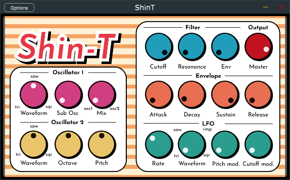

# **ShinT**

Polyphonic subtractive synthesizer made in JUCE using the DaisySP library & Foleys Plugin GUI Magic for the Ear Candy Technologies Audio Plug-ins Course 2024.

### **Credits**

- [Ear Candy Technologies](https://github.com/Ear-Candy-Technologies)
- [DaisySP](https://github.com/electro-smith/DaisySP) by Electrosmith
- [JUCE](https://github.com/juce-framework/JUCE) by ROLI Ltd.
- [Foleys Plugin Gui Magic](https://github.com/ffAudio/foleys_gui_magic)  by Foleys Finest